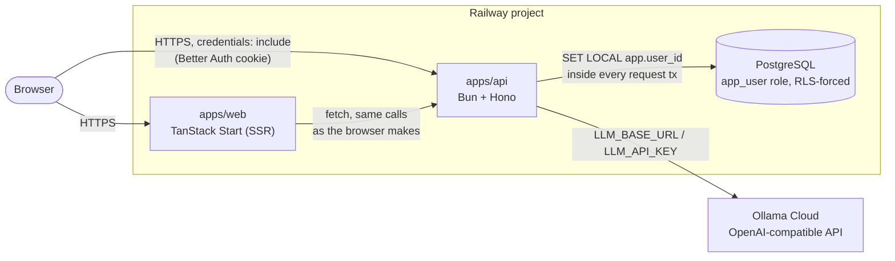
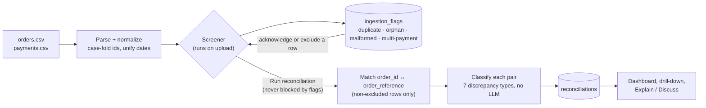
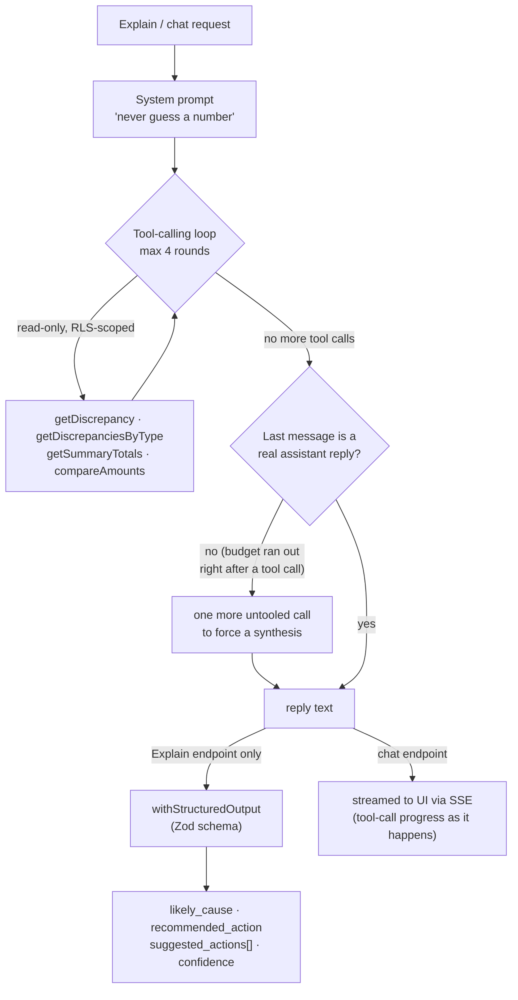

# Reconciliation Dashboard
### Technical Interview Project


An online store keeps two records of the same money: its order system (`orders.csv` — what it believes it sold) and its payment processor (`payments.csv` — what was actually charged, refunded, or settled). This app ingests both, deterministically reconciles them, and presents the result as a dashboard someone responsible for revenue could act on, with an LLM layer that explains individual discrepancies in plain language.

No company name, real customer data, or real credentials appear anywhere in this repo — the sample CSVs use invented emails and order ids.

## Live deployment

- **App**: https://web-production-e8c73.up.railway.app
- **API**: https://api-production-4c28.up.railway.app
- **Test login**: `smoketest3@example.com` / `correcthorsebattery` — already has both CSVs uploaded and reconciled, so the dashboard has data immediately. Or sign up your own account.

## How it works, end to end

1. Sign up / log in (real per-user email+password auth).
2. Upload `orders.csv` and `payments.csv` on `/upload`.
3. Immediately see a **screening report**: structural data-quality issues found while parsing (duplicate ids, orphan rows, case mismatches, malformed rows). These are informational — they never block you — but each flag can be acknowledged or excluded. For a group flag (a duplicate id, or multiple payments against one order), **Compare rows** opens all the rows in that group side by side in one screen, with mismatched fields highlighted and a checkbox per row — uncheck the ones you want excluded from reconciliation and apply the selection in one go, rather than guessing from a summary count whether it's a harmless duplicate or something like a legitimate charge + refund pair.
4. Click **Run reconciliation**. The backend deterministically matches every order to its payment(s) and classifies each pair. No LLM involved in this step. (If you jump straight to the dashboard after uploading without running it, the dashboard notices and offers to run it for you right there, or take you back to the screening report first.)
5. Land on `/dashboard`: headline figures, a chart of discrepancies by type, and — alongside it, filling the same height rather than squeezed into a corner — an **AI insight** panel: a generated portfolio-level summary of what's driving the risk (not per-row), plus a live **"ask about your data"** chat for open-ended questions across the whole reconciliation ("which discrepancy type has the biggest dollar impact", "what should I prioritize first"). A thin progress indicator (Upload → Screening → Reconcile → Results) runs across the top of both `/upload` and `/dashboard`, so it reads as one flow rather than three unrelated pages.
6. On `/discrepancies`, filter/search, open any row to see a side-by-side comparison of the order and payment record with the mismatched fields highlighted — not a raw JSON dump. From there, click **Explain** for an LLM-generated plain-language explanation plus a short list of concrete suggested next steps, or switch to **Discuss** for a follow-up chat about that specific discrepancy (e.g. "what should I tell the customer").

## Architecture

```
apps/web   TanStack Start (React, SSR) + real shadcn/ui components (sidebar, chart, sheet, chat) + Tailwind
apps/api   Bun + Hono API — auth, ingestion, reconciliation, LLM explanation
data/      the two sample CSVs used for reconciliation
```

Both are separate services (separate Railway deployments), talking over HTTP with credentials-included cookies (Better Auth session cookie, `SameSite=None; Secure` in production since they're on different subdomains).



- **DB**: PostgreSQL. `apps/api/src/db/schema.ts` is the Drizzle schema; the actual DDL — including roles and RLS policies, which Drizzle doesn't diff — lives in `apps/api/sql/*.sql` and is applied by `bun run db:migrate`.
- **Per-user isolation**: enforced by **Postgres Row-Level Security**, not just an app-level `WHERE user_id = ...`. The API connects as an `app_user` role that has `FORCE ROW LEVEL SECURITY` on every business table; a separate `migrator` role (table owner, bypasses RLS) is only used for migrations. Every request wraps its DB work in `withUserContext(userId, ...)` (`apps/api/src/db/withUserContext.ts`), which runs `SET LOCAL app.user_id = '<id>'` inside a transaction before any query — so even a query that forgot a `WHERE user_id` clause still can't see another user's rows, and a forgotten context (`app.user_id` unset) returns **zero rows**, not an error and not everything. This was verified directly against Postgres during development (fail-closed with no context, per-user isolation, and a blocked cross-user `INSERT` via the `WITH CHECK` clause).
- **Auth**: [Better Auth](https://www.better-auth.com/), email + password, session cookie. Password hashing is Bun's native `Bun.password` (argon2id) wired in as Better Auth's hash/verify functions, instead of its default JS scrypt.
- **LLM**: LangChain (JS) tool-calling agent over an OpenAI-compatible client (defaults to Ollama Cloud's hosted API). See [LLM approach](#llm-approach) below.

### Bun-native choices

- `Bun.sql` (native Postgres client) as the Drizzle driver (`drizzle-orm/bun-sql`) — no `pg`/`postgres.js`.
- `Bun.password` (argon2id) for password hashing.
- `Bun.CryptoHasher`, `Bun.Glob`, `Bun.file` used in place of Node's `crypto`/`fs` equivalents.
- `Bun.markdown.html()` to render chat replies server-side — no `marked`/`remark` dependency.
- `.env` loaded natively by Bun — no `dotenv`.
- `bun test` for the reconciliation-engine and CSV-parsing self-checks.

## Running locally

Requires Bun 1.4+ and a Postgres instance.

```bash
bun install

cp apps/api/.env.example apps/api/.env      # fill in DATABASE_URL, APP_DATABASE_URL, etc.
cp apps/web/.env.example apps/web/.env

bun run db:migrate     # creates tables, the app_user role, and RLS policies
bun run dev:api        # http://localhost:3001
bun run dev:web        # http://localhost:3000
```

`DATABASE_URL` should point at a role that owns the database (used only for migrations). `APP_DATABASE_URL` should point at the `app_user` role migrations create — pick its password via `APP_DB_PASSWORD` before the first migration run.

Run tests: `bun run test` (or `cd apps/api && bun test`).

## Reconciliation logic

### Matching

Orders and payments are matched on `order_id` ↔ `order_reference`, case-insensitive and trimmed (stored as `*_normalized` columns). This was necessary: the data contains at least one payment referencing `ord-1802` in lowercase.

### Discrepancy types and tolerances

| Type | Condition |
|---|---|
| `MISSING_PAYMENT` | Order is `completed`, no payment row references it |
| `MISSING_ORDER` | A payment references an order id that doesn't exist |
| `AMOUNT_MISMATCH` | Matched pair, `\|order.net_amount − payment.amount\| > $0.01` |
| `CURRENCY_MISMATCH` | Matched pair, currencies differ |
| `STATUS_MISMATCH` | Order `cancelled`/`refunded` but there's a settled charge with no offsetting refund; or order `completed` but its only payment(s) `failed`/`pending` |
| `DUPLICATE_PAYMENT` | More than one settled charge for one order, no refund explaining the second |
| `UNRESOLVED_REFUND` | Order `refunded`, no `refund`-type payment row found for it |

**Why `net_amount`, not `gross_amount` or `net_settled`:** `orders.net_amount` (gross minus discount) is what the store expects to receive; `payments.amount` is what was actually charged before the processor's fee. Comparing `net_amount` to `amount` isolates order-vs-payment disagreement from the processor's fee, which is a separate, expected deduction — not a discrepancy.

**Why $0.01 tolerance:** absorbs floating-point/rounding noise in the source exports without hiding real cent-level mismatches.

**Why these specific types and not, say, one generic "mismatch":** each implies a different root cause and a different action — a missing payment means chase the processor or write off the order; a duplicate payment means refund the customer; a currency mismatch usually means a data-entry error, not lost money. Collapsing them into one bucket would make the dashboard look "bad" without telling anyone what to do about it, which the brief specifically asks the dashboard to answer.

**Known limitation:** the data has one duplicate `order_id` row (`ORD-1004`). Each row is reconciled independently rather than being deduplicated first — with more time this would be flagged and merged rather than producing two reconciliation rows for the same logical order.

### What the screener catches vs. what reconciliation catches

These are deliberately separate concerns:


- The **screener** (runs on upload) catches structural/data-quality problems: malformed rows, duplicate keys, case mismatches, orphan rows, multiple payments per order. It's informational — it never blocks reconciliation — but every flag can be acknowledged or excluded (excluding removes that row from reconciliation).
- **Reconciliation** (runs on demand) catches business-level disagreement between matched orders and payments, using the types above.

## What was found in the data

Running the pipeline against the provided `orders.csv` (185 rows) / `payments.csv` (187 rows):

- **1 duplicate `order_id`** (`ORD-1004`) in orders.
- **2 case-mismatched references** in payments (`ord-1802`, ` ord-1801 ` with stray whitespace) — silently normalized, but flagged so it's auditable rather than invisible.
- **4 orphan orders** (`ORD-1201`–`ORD-1204`): completed orders with no payment record at all. This is money the store believes it earned but the processor never charged — the highest-priority thing to chase, since it's revenue that may simply not exist.
- **3 orphan payments** (referencing `ORD-1301`–`ORD-1303`): charges with no matching order. Either an order-system export gap, or payments taken for orders that were never recorded — worth investigating for missing revenue recognition.
- **4 order/payment pairs with two payments each** (`ORD-1501`, `ORD-1502`, `ORD-1702`, `ORD-1703`): some resolve to a legitimate charge+refund, others reconcile as `DUPLICATE_PAYMENT` — a customer charged twice with no refund issued, which is a direct customer-trust and chargeback risk.
- Beyond structural issues, reconciliation itself found (on this dataset): 4 `AMOUNT_MISMATCH`, 4 `MISSING_PAYMENT`, 3 `MISSING_ORDER`, 3 `STATUS_MISMATCH`, 2 `DUPLICATE_PAYMENT`, 2 `CURRENCY_MISMATCH` — 18 discrepancies out of 188 reconciled pairs, the rest matched cleanly.
- Two currencies appear in both files (USD and EUR) — no FX conversion is attempted; a currency mismatch on an otherwise-matching order/payment pair is flagged as its own type rather than guessed at.

**What this would mean for the business:** the orphan orders and duplicate payments are the two that involve real money at risk today (revenue that may not materialize, and a refund obligation, respectively); the rest are largely data-hygiene issues (case sensitivity, date format drift between the two export formats) that don't move money but would keep causing false alarms on every future reconciliation run until fixed at the source.

## LLM approach

Explanations are generated by a **LangChain tool-calling agent** (`apps/api/src/lib/llm/agent.ts`), not a single prompt stuffed with numbers. The agent has four read-only tools (`apps/api/src/lib/llm/tools.ts`) scoped to the calling user:

- `getDiscrepancy(id)` — the discrepancy plus its linked raw order/payment rows
- `getDiscrepanciesByType(type)` — for "explain all X" style questions
- `getSummaryTotals()` — the same figures as the dashboard
- `compareAmounts(a, b)` — deterministic diff/percentage calculator

The system prompt tells the model explicitly not to guess or compute numbers itself — it fetches facts and does arithmetic through the tools, then explains what the tools returned. This keeps the explanation grounded in the same data the deterministic engine already computed, rather than the model re-deriving (and potentially hallucinating) numbers from context. The agent never writes to the database and has no path to influence matching — matching already happened before it's ever called.



Every tool call and result streams to the frontend live over SSE as it happens (`chat.ts`/`dashboard.ts` use `hono/streaming`'s `streamSSE`), so the chat UI shows what the agent is doing — "Looking up the discrepancy", "Calculating summary totals" — instead of a plain spinner while the model works.

**Structured output**: after the tool-calling loop finishes, a final call with `withStructuredOutput` against a Zod schema (`{ likely_cause, recommended_action, suggested_actions[], confidence }`) produces the response the frontend renders — no manual JSON parsing, and the SDK rejects a response that doesn't fit the schema. `suggested_actions` is a short list of concrete next steps shown as chips in the UI — purely informational, the model never gets a path to trigger anything itself.

**Temperature: 0.2.** This is explanation over already-known facts, not creative generation — low temperature keeps repeated explanations of similar discrepancies consistent. Not `0`, because slight wording variation across similar cases is fine and a small amount of temperature makes the agent's tool-call phrasing less brittle.

**Handling bad responses**: `explainWithFallback` retries once on any failure (network, malformed structured output, tool error), then returns an explicit `explanation_unavailable` result. The API returns HTTP 502 in that case and the frontend shows an error state with a retry button — it never silently shows nothing or crashes the page. Explanations are cached (`discrepancy_explanations` table) once generated, so reopening a row doesn't re-call the LLM.

**Provider**: any OpenAI-compatible endpoint via `LLM_BASE_URL` / `LLM_API_KEY` / `LLM_MODEL` env vars. The deployed instance points at [Ollama Cloud](https://ollama.com)'s hosted OpenAI-compatible API (`https://ollama.com/v1`, model `gpt-oss:20b`, available on the free tier) rather than a locally-run Ollama server, since the brief requires the LLM call to work from the live deployment, not just a developer's machine. Swapping to Groq, OpenRouter, or a self-hosted Ollama box is a config change, not a code change.

**Follow-up chat**: the "Discuss" tab on a discrepancy (`apps/api/src/routes/chat.ts`, `chatReply` in `agent.ts`) is a second, separate use of the same agent — same tools, same "never guess a number" system prompt, same fallback-on-failure handling — but for an open-ended conversation instead of one fixed structured shape. History is persisted per discrepancy (`discrepancy_chat_messages`, RLS-scoped like every other table) so reopening a row keeps the conversation. Replies are plain markdown, rendered server-side to HTML with Bun's native `Bun.markdown.html()` (no extra markdown dependency) before being sent to the frontend.

**Dashboard-level insight and chat**: the four discrepancy-type cards that used to sit at the bottom of the dashboard were 100% static copy — no LLM involved, which defeats the point of having one. `POST /api/dashboard/insight` calls the same agent for a portfolio-wide summary (one `getSummaryTotals` call, which already carries a full `byType` breakdown with both counts and dollar amounts, is enough — the prompt explicitly tells the model not to call anything else, since an earlier version that let it call `getDiscrepanciesByType` per type pushed a single request past a minute). The result is cached (`dashboard_insights`, one row per user, replaced on regenerate) so it's not recomputed on every page load. `dashboard_chat_messages` backs a second, general-purpose "ask about your data" thread (`dashboardChatReply`) that isn't scoped to one discrepancy — same tools, same guardrails.

**A real bug this surfaced**: the chat loop caps itself at a few tool-call rounds; if that budget runs out right after a tool call rather than after the model's own reply, the *last* message in the conversation is raw tool JSON, not English. The original code trusted "whatever's last" — a broader question (more tool calls needed) hit this and the user would have seen a JSON blob instead of an answer. Fixed by checking whether the last message is actually a usable assistant reply, and if not, making one further untooled call to force a real synthesis before returning anything. Also added a 25s timeout on every LLM call: a slow one was observed getting silently retried by Railway's own edge proxy, multiplying LLM spend for a single click — the frontend now treats a failed generate/explain call as "check whether it actually finished" before showing an error, since the request can complete server-side after the client's connection times out.

## What I'd improve with more time

- Deduplicate the one duplicate `order_id` before reconciling instead of reconciling both rows independently.
- FX conversion for cross-currency comparison instead of flagging and stopping there.
- Real pagination on the drill-down table (fine at ~200 rows, wouldn't be at scale).
- Rate-limiting / cost guardrails around the LLM endpoint — right now nothing stops a user from spamming "regenerate insight" or the chat.
- Stream chat/explain responses token-by-token instead of waiting for the full reply; would also sidestep the edge-proxy-timeout issue documented above.

## AI tool usage note

Built with Claude Code, used for the full implementation loop (planning, writing, and directly testing the code — including spinning up a local Postgres instance to verify the RLS policies and the reconciliation engine actually behave correctly against the real CSVs, not just that they compile).
